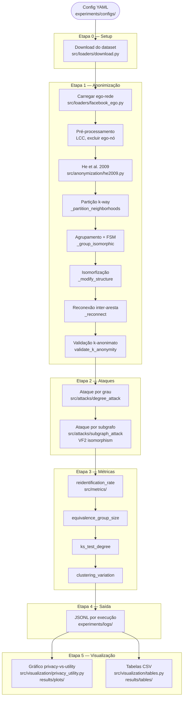
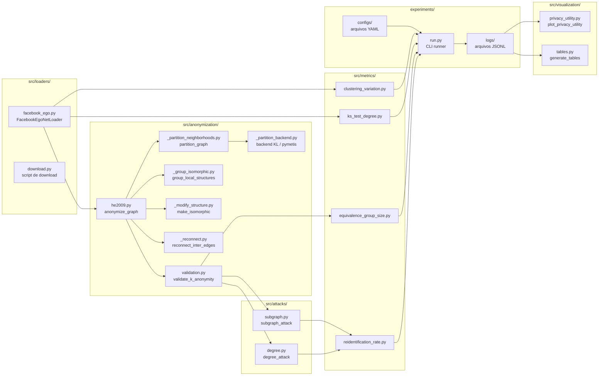

# Pipeline Técnico — Módulo de Reidentificação

> **Issue de origem:** [S4][#26-B] Produção técnica codificada da documentação do pipeline (#64).
> **Última atualização:** 2026-05-25.
>
> **Referências cruzadas:**
> - [`docs/algorithm_notes.md`](algorithm_notes.md) — algoritmo He et al. (2009), decisões D-01 a D-07
> - [`docs/metrics_definitions.md`](metrics_definitions.md) — definições operacionais de todas as métricas
> - [`docs/limitations.md`](limitations.md) — limitações de escopo e técnicas do protótipo

---

## Sumário

1. [Visão geral do pipeline](#1-visão-geral-do-pipeline)
2. [Diagrama de fluxo de execução](#2-diagrama-de-fluxo-de-execução)
3. [Diagrama de arquitetura de módulos](#3-diagrama-de-arquitetura-de-módulos)
4. [Pré-requisitos de ambiente](#4-pré-requisitos-de-ambiente)
5. [Comandos reproduzíveis por etapa](#5-comandos-reproduzíveis-por-etapa)
6. [Parâmetros de configuração YAML](#6-parâmetros-de-configuração-yaml)
7. [Outputs esperados](#7-outputs-esperados)

---

## 1. Visão geral do pipeline

O pipeline transforma um grafo social real em métricas de privacidade e
utilidade seguindo três etapas sequenciais:

```
Config YAML  →  Anonimização (He et al. 2009)  →  Ataques  →  Métricas  →  Visualizações
```

Cada etapa é independentemente testável e parametrizada por um arquivo YAML
em `experiments/configs/`. O resultado final é um conjunto de arquivos JSONL
(logs estruturados) e CSVs/PNGs/PDFs de visualização, todos localizados em
`experiments/logs/` e `results/`.

**Conjunto de parâmetros do baseline:**

| Parâmetro | Valor(es) |
|-----------|-----------|
| Dataset | Facebook Ego-Net 3437 (n_lcc=532, m_lcc=4812) |
| Algoritmo | He et al. (2009), d=1, sigma=0.5 |
| k | 2, 5, 10, 20 |
| Ataques | grau (tolerance=0) + subgrafo (hop=1, timeout=60s) |
| Sementes | 42, 1337, 2718 |

---

## 2. Diagrama de fluxo de execução



---

## 3. Diagrama de arquitetura de módulos



---

## 4. Pré-requisitos de ambiente

### 4.1 Dependências

| Pacote | Versão mínima | Papel |
|--------|---------------|-------|
| Python | 3.11+ | interpretador |
| NetworkX | 3.x | representação de grafos, VF2 |
| SciPy | 1.x | `ks_2samp` (KS-test) |
| PyYAML | 6.x | leitura de configs |
| Matplotlib | 3.x | geração de gráficos |
| pymetis | 2023.x | motor de partição primário (opcional; fallback KL sem C) |

> **Nota:** `pymetis` exige compilação C. Em ambientes sem dependências C
> (ex.: CI), o backend recai automaticamente para `networkx-kl`
> (decisão D-04 — ver [`docs/algorithm_notes.md`](algorithm_notes.md#7-decisões-de-implementação)).

### 4.2 Instalação

```bash
# Criar e ativar ambiente virtual
python -m venv .venv

# Linux/macOS
source .venv/bin/activate

# Windows (PowerShell)
.venv\Scripts\Activate.ps1

# Instalar dependências de produção e desenvolvimento
pip install -r requirements.txt -r requirements-dev.txt
```

### 4.3 Verificação do ambiente

```bash
# Lint e formatação
ruff check .
ruff format .

# Suíte de testes completa
pytest

# Testes por módulo
pytest tests/loaders -v
pytest tests/anonymization -v
pytest tests/attacks -v
pytest tests/metrics -v
pytest tests/visualization -v
```

---

## 5. Comandos reproduzíveis por etapa

### 5.1 Download do dataset

```bash
# Baixa Facebook Ego-Nets da SNAP para data/raw/facebook/
# Executa uma única vez; saída não versionada (.gitignore).
python -m src.loaders.download
```

**O que faz:** faz download e descompacta o arquivo
`facebook_combined.txt.gz` da SNAP para `data/raw/facebook/`.

**Pré-condição:** acesso à internet; diretório `data/raw/facebook/` criado
automaticamente pelo script.

**Saída:** `data/raw/facebook/facebook_combined.txt` (arquivo de arestas
no formato `node_u node_v` por linha, não versionado).

---

### 5.2 Configuração do experimento

```bash
# Copiar template de configuração e ajustar parâmetros
cp config_example.yml experiments/configs/meu_experimento.yml
# Editar conforme necessário (k, d, sigma, ataques, sementes)
```

**Estrutura do YAML:** ver [Seção 6](#6-parâmetros-de-configuração-yaml) e
[`config_example.yml`](../config_example.yml).

**Config do baseline:**

```bash
# Config já versionada — usada para produzir os resultados em docs/results_baseline.md
experiments/configs/he2009_facebook_baseline.yml
```

---

### 5.3 Execução do experimento completo

```bash
# Execução com a config do baseline (issue #23)
python -m experiments.run \
    --config experiments/configs/he2009_facebook_baseline.yml

# Execução com config customizada
python -m experiments.run \
    --config experiments/configs/meu_experimento.yml
```

**O que faz:** itera sobre todas as combinações `(k, seed)` definidas no
YAML e, para cada uma:

1. Carrega a ego-rede e aplica pré-processamento (LCC, excluir ego-nó).
2. Anonimiza via He et al. (2009).
3. Valida k-anonimato empiricamente (`validate_k_anonymity`).
4. Executa os ataques habilitados (grau e/ou subgrafo).
5. Calcula as quatro métricas.
6. Grava resultado em `experiments/logs/<experiment_name>/<experiment_name>.jsonl`.

**Saída:** ver [Seção 7.1](#71-logs-jsonl).

**Tempo estimado (baseline, hardware típico):**

| Etapa | Tempo estimado |
|-------|----------------|
| Anonimização (He et al., d=1) | ~2 s por (k, seed) |
| Ataque por grau | < 1 s por (k, seed) |
| Ataque por subgrafo (hop=1, timeout=60s) | ~30–60 s por (k, seed) |
| **Total baseline (4k × 3 seeds = 12 runs)** | **~6–12 min** |

---

### 5.4 Geração do gráfico privacy-vs-utility

```bash
# Gera figura PDF + PNG a partir dos logs JSONL
python -m src.visualization.privacy_utility \
    --logs experiments/logs/he2009_facebook_baseline \
    --dataset facebook

# Saída padrão: results/plots/privacy_utility_facebook.{pdf,png}
# Opção --out para diretório customizado:
python -m src.visualization.privacy_utility \
    --logs experiments/logs/he2009_facebook_baseline \
    --dataset facebook \
    --out results/plots
```

**O que produz:** figura de 2 painéis lado a lado:
- **Painel esquerdo — Privacidade:** taxa de reidentificação (%) vs. k,
  uma curva por ataque, barras de erro ±1 desvio-padrão entre sementes.
- **Painel direito — Utilidade:** `clustering_variation` e `ks_D` vs. k,
  barras de erro ±1 desvio-padrão entre sementes.

**Saída:** ver [Seção 7.2](#72-gráficos-privacy-vs-utility).

---

### 5.5 Geração das tabelas CSV

```bash
# Gera uma tabela CSV por (dataset, ataque) a partir dos logs JSONL
python -m src.visualization.tables \
    --logs experiments/logs/he2009_facebook_baseline \
    --dataset facebook

# Saída padrão: results/tables/
# Opção --out para diretório customizado:
python -m src.visualization.tables \
    --logs experiments/logs/he2009_facebook_baseline \
    --dataset facebook \
    --out results/tables
```

**O que produz:** um arquivo CSV por par `(dataset, ataque)`, com as
colunas `k, seed, reid_rate, eq_group_mean, ks_D, ks_p, clustering_var`.

**Saída:** ver [Seção 7.3](#73-tabelas-csv).

---

### 5.6 Reprodução completa do zero (sequência canônica)

```bash
# 1. Instalar dependências
pip install -r requirements.txt -r requirements-dev.txt

# 2. Download do dataset (uma única vez)
python -m src.loaders.download

# 3. Executar experimento baseline
python -m experiments.run \
    --config experiments/configs/he2009_facebook_baseline.yml

# 4. Gerar gráfico
python -m src.visualization.privacy_utility \
    --logs experiments/logs/he2009_facebook_baseline \
    --dataset facebook \
    --out results/plots

# 5. Gerar tabelas CSV
python -m src.visualization.tables \
    --logs experiments/logs/he2009_facebook_baseline \
    --dataset facebook \
    --out results/tables
```

> **Nota de reprodutibilidade:** os resultados são determinísticos dado o
> conjunto de sementes configurado no YAML. As sementes controlam todos os
> pontos de não-determinismo do algoritmo (ver
> [`docs/algorithm_notes.md`](algorithm_notes.md#33-determinismo-vs-aleatoriedade) §3.3).
> Sementes são lidas exclusivamente do YAML — nunca hardcoded no código.

---

## 6. Parâmetros de configuração YAML

Esta seção documenta os parâmetros efetivamente expostos e utilizados no
baseline. Para a discussão conceitual de parâmetros futuros (`s_max`,
`partition_backend`, `isomorphism_mode`), ver
[`docs/algorithm_notes.md`](algorithm_notes.md#5-parâmetros-e-configuração) §5.

### 6.1 Seção `experiment`

| Chave | Tipo | Obrigatório | Descrição |
|-------|------|-------------|-----------|
| `name` | `str` | sim | Identificador do experimento; usado como nome do diretório de logs |
| `description` | `str` | não | Descrição livre para documentação |
| `output_dir` | `str` | não | Diretório de saída para gráficos e tabelas (default: `results/<name>`) |

### 6.2 Seção `seeds`

| Chave | Tipo | Obrigatório | Descrição |
|-------|------|-------------|-----------|
| `seeds` | `list[int]` | sim | Lista de sementes aleatórias; mínimo 3 por regra do projeto |

### 6.3 Seção `dataset`

| Chave | Tipo | Obrigatório | Descrição |
|-------|------|-------------|-----------|
| `name` | `str` | sim | `facebook_ego_nets` ou `email_enron` |
| `source` | `str` | sim | `snap` |
| `data_path` | `str` | sim | Caminho para os dados brutos (ex.: `data/raw/facebook/`) |
| `preprocessing_mode` | `str` | sim | `single_egonet` (baseline) ou `multiple_egonets` |
| `egonet_id` | `int` | se single | Identificador da ego-rede (baseline: `3437`) |
| `egonet_ids` | `list[int]` | se multiple | Lista de IDs das ego-redes |
| `include_ego` | `bool` | sim | `false` — nó ego excluído (decisão §3.1 de `preprocessing_decision.md`) |
| `component` | `str` | sim | `lcc` — reter maior componente conexo |
| `min_nodes` | `int` | sim | Limiar mínimo de nós (baseline: `200 = 10 * k_max`) |

### 6.4 Seção `anonymization`

| Chave | Tipo | Obrigatório | Descrição |
|-------|------|-------------|-----------|
| `algorithm` | `str` | sim | `he_2009` |
| `k` | `list[int]` | sim | Valores de k a varrer (baseline: `[2, 5, 10, 20]`) |
| `d` | `int` | sim | Tamanho de cada Local Structure (baseline: `1`; ver D-02) |
| `sigma` | `float` | sim | Suporte mínimo do FSM simplificado (baseline: `0.5`; ver D-01) |

> **Impacto metodológico de `d`:** com `d=1`, a Local Structure de cada nó
> é trivial (subgrafo unitário) e o isomorfismo reduz-se à igualdade de grau.
> O k-anonimato *estrutural pleno* (no sentido de He et al.) só é demonstrável
> para `d > 1`. Ver [`docs/limitations.md`](limitations.md#13-varredura-de-parâmetros-restrita-a-k--2-5-10-20-e-d--1) §1.3.

### 6.5 Seção `attacks`

| Chave | Tipo | Obrigatório | Descrição |
|-------|------|-------------|-----------|
| `degree.enabled` | `bool` | sim | Habilitar ataque por grau |
| `degree.tolerance` | `int` | se enabled | Tolerância no matching de grau (baseline: `0` = exato) |
| `subgraph.enabled` | `bool` | sim | Habilitar ataque por subgrafo |
| `subgraph.hop` | `int` | se enabled | Raio da vizinhança para extração do subgrafo (baseline: `1`) |
| `subgraph.timeout` | `int` | não | Timeout em segundos por nó-alvo no VF2 (baseline: `60`) |

### 6.6 Seção `runtime`

| Chave | Tipo | Padrão | Descrição |
|-------|------|--------|-----------|
| `log_level` | `str` | `INFO` | Nível de log (`DEBUG`, `INFO`, `WARNING`) |
| `log_dir` | `str` | `experiments/logs/` | Diretório raiz dos logs JSONL |

---

## 7. Outputs esperados

Todos os outputs de dados (logs, gráficos, tabelas, dados brutos) são
**não versionados** — estão registrados no `.gitignore`. Apenas os
**arquivos de configuração** (`experiments/configs/*.yml`) e
**documentação de resultados** (`docs/results_baseline.md`) são versionados.

### 7.1 Logs JSONL

**Localização:** `experiments/logs/<experiment_name>/<experiment_name>.jsonl`

**Formato:** um objeto JSON por linha (JSONL), um objeto por execução
`(k, seed)`. Schema DL-01 (schema interno do projeto):

```json
{
  "experiment": "he2009_facebook_baseline",
  "dataset": "facebook_ego_nets",
  "egonet_id": 3437,
  "k": 5,
  "seed": 42,
  "d": 1,
  "sigma": 0.5,
  "partition_backend": "pymetis",
  "verdict": "SUCCESS_PARTIAL",
  "satisfied_fraction": 0.9962,
  "coverage_fraction": 0.9962,
  "deficit_fully_structural": true,
  "attacks": {
    "degree": {
      "reidentification_rate": 0.0075,
      "eq_group_mean": 4.97,
      "eq_group_median": 5.0
    },
    "subgraph": {
      "reidentification_rate": 0.4192
    }
  },
  "metrics": {
    "ks_D": 0.0451,
    "ks_p": 0.6516,
    "clustering_var": 0.0527
  }
}
```

O campo `partition_backend` registra o motor de particionamento
efetivamente usado na execução — `"pymetis"` (fiel a He et al., D-04) ou
`"networkx-kl"` (fallback, com degradação de sizing conhecida para `ck>2`).
Torna cada resultado auto-documentado quanto ao backend, sem depender de
inspecionar o `UserWarning` transitório de runtime. Ver
[`docs/algorithm_notes.md`](algorithm_notes.md) §7 (D-04/D-07).

**Arquivo `summary.json`:** agregações por `(k)` sobre as sementes,
gerado automaticamente junto ao JSONL. Inclui o campo `partition_backends`
(lista dos backends distintos observados nas execuções).

---

### 7.2 Gráficos privacy-vs-utility

**Localização:** `results/plots/`

| Arquivo | Descrição |
|---------|-----------|
| `privacy_utility_<dataset>.pdf` | Figura vetorial (qualidade de impressão) |
| `privacy_utility_<dataset>.png` | Raster 150 DPI (inserção em documentos) |

**Conteúdo:** figura de 2 painéis (ver [§5.4](#54-geração-do-gráfico-privacy-vs-utility)).

---

### 7.3 Tabelas CSV

**Localização:** `results/tables/`

| Arquivo | Descrição |
|---------|-----------|
| `<dataset>_degree.csv` | Resultados do ataque por grau |
| `<dataset>_subgraph.csv` | Resultados do ataque por subgrafo |

**Colunas:** `k, seed, reid_rate, eq_group_mean, ks_D, ks_p, clustering_var`

**Exemplo de linha:**

```
k,seed,reid_rate,eq_group_mean,ks_D,ks_p,clustering_var
5,42,0.0075,4.97,0.0451,0.6516,0.0527
```

---

### 7.4 Dados brutos (input)

**Localização:** `data/raw/facebook/`

| Arquivo | Descrição |
|---------|-----------|
| `facebook_combined.txt` | Arquivo de arestas da coleção Facebook Ego-Nets (SNAP) |

> Baixado por `python -m src.loaders.download`. Não versionado.
> Fonte: [SNAP — Social Circles: Facebook](https://snap.stanford.edu/data/egonets-Facebook.html).

---

### 7.5 Dados processados (intermediários)

**Localização:** `data/processed/facebook/` (quando aplicável)

Arquivos NetworkX serializados (`.gpickle` ou equivalente) produzidos pelo
loader após pré-processamento. Não versionados; regenerados automaticamente
pelo runner se ausentes.

---

## Referências cruzadas consolidadas

| Documento | Conteúdo relevante para este pipeline |
|-----------|--------------------------------------|
| [`docs/algorithm_notes.md`](algorithm_notes.md) | Pseudocódigo He et al., decisões D-01 a D-07, parâmetros formais, análise de casos especiais |
| [`docs/metrics_definitions.md`](metrics_definitions.md) | Definições precisas de `reidentification_rate`, `equivalence_group_size`, `ks_test_degree`, `clustering_variation` e verificador de k-anonimato |
| [`docs/limitations.md`](limitations.md) | Limitações de escopo (d=1, dataset único, ataques restritos) e técnicas (FSM simplificado, fallback KL, grupos incompletos) |
| [`config_example.yml`](../config_example.yml) | Template de configuração YAML comentado |
| [`docs/results_baseline.md`](results_baseline.md) | Tabelas de resultados do baseline (#23) |
| [`docs/validacao_k_anonimato.md`](validacao_k_anonimato.md) | Resultados consolidados da validação k-anonimato (marco 29/05/2026) |
