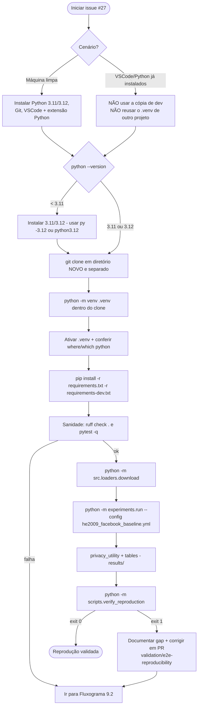
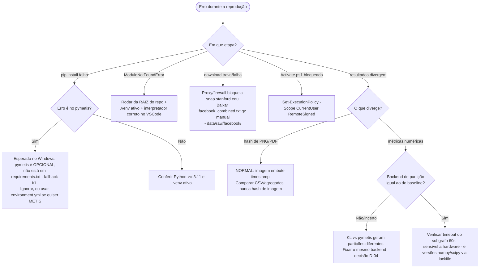
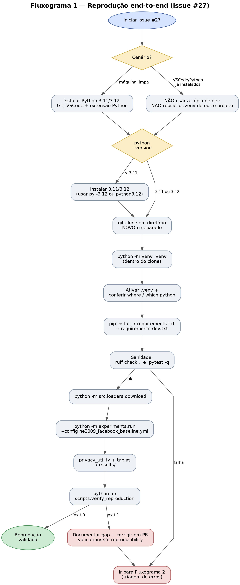
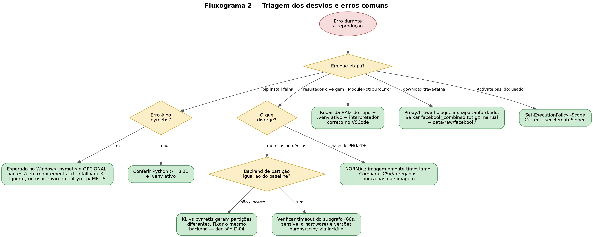

# docs/reproducibility.md — Guia de reprodução end-to-end

> **Issue de origem:** [S5] [#27](https://github.com/chrisjulio/moduloreidentificacao/issues/27) — Reprodutibilidade end-to-end (do zero).
> **Branch sugerida:** `validation/e2e-reproducibility`.
> **Última atualização:** 2026-05-26.
>
> **Referências cruzadas:**
> - [`docs/pipeline.md`](pipeline.md) §5 — comandos reproduzíveis por etapa (sequência canônica).
> - [`docs/results_baseline.md`](results_baseline.md) — valores de referência do baseline.
> - [`docs/decision_log.md`](decision_log.md) — decisão **D-04** (backend de partição).
> - [`docs/algorithm_notes.md`](algorithm_notes.md) §3.3 — determinismo e sementes.
> - [`README.md`](../README.md) — visão operacional geral.

---

## Sumário

1. [Objetivo e escopo](#1-objetivo-e-escopo)
2. [Pré-requisitos](#2-pré-requisitos)
3. [Cenário 1 — ambiente de desenvolvimento já existente](#3-cenário-1--ambiente-de-desenvolvimento-já-existente)
4. [Cenário 2 — máquina limpa](#4-cenário-2--máquina-limpa)
5. [Pipeline canônico de reprodução](#5-pipeline-canônico-de-reprodução)
6. [Verificação dos resultados](#6-verificação-dos-resultados)
7. [Desvios e erros comuns (troubleshooting)](#7-desvios-e-erros-comuns-troubleshooting)
8. [Determinismo e fatores que afetam a reprodução](#8-determinismo-e-fatores-que-afetam-a-reprodução)
9. [Fluxogramas](#9-fluxogramas)
10. [Checklist de entrega da issue #27](#10-checklist-de-entrega-da-issue-27)

---

## 1. Objetivo e escopo

Este documento orienta a **reprodução do baseline do módulo a partir de um clone
limpo**, em um ambiente novo, sem depender de estado oculto da máquina de
desenvolvimento. É o procedimento operacional da issue #27.

O resultado esperado é que os agregados produzidos localmente coincidam, dentro
de uma tolerância numérica, com os valores registrados em
[`docs/results_baseline.md`](results_baseline.md).

> **Nota de escopo — correção da Definição de Pronto da issue #27.** A redação
> original da issue pede comparar os outputs com *"a versão em `main`"*. Isso é
> inviável: `results/tables/*`, `results/plots/*` e `experiments/logs/*` estão no
> `.gitignore` e **não existem versionados em `main`**. A referência canônica é
> `docs/results_baseline.md`. Toda verificação neste guia compara contra esse
> arquivo, não contra artefatos de `main`.

Dois cenários são contemplados:

- **Cenário 1** — o usuário já tem Python/VSCode instalados (possivelmente este
  mesmo projeto em desenvolvimento, mais outros projetos).
- **Cenário 2** — máquina limpa, Python/VSCode recém-instalados.

O ponto central, válido para os dois: a issue #27 exige **clone novo em
diretório separado** e **`.venv` novo**. Mesmo no Cenário 1, a reprodução
**não** ocorre na cópia de trabalho atual. A diferença entre os cenários está
quase toda na etapa de pré-requisitos e no perfil de risco — não nos comandos do
pipeline.

---

## 2. Pré-requisitos

### 2.1 Versões

| Componente | Requisito | Fonte |
|---|---|---|
| Python | 3.11 ou 3.12 | `pyproject.toml` (`requires-python = ">=3.11"`); CI testa 3.11 e 3.12 |
| Git | qualquer versão recente | clonagem do repositório |
| VSCode + extensão Python | opcional, recomendado | edição e seleção de interpretador |
| Acesso à internet | necessário na etapa de download | `src/loaders/download.py` busca o dataset no SNAP |

O backend de particionamento `pymetis` é **opcional**. Quando ausente, o
algoritmo recai automaticamente para o backend Kernighan-Lin (decisão **D-04**).
Ver [§8.1](#81-backend-de-partição-d-04) — esta escolha **afeta a reprodução**.

### 2.2 Por sistema operacional

- **Linux / macOS:** `venv + pip` cobre todo o fluxo. `pymetis`, se desejado,
  instala via `pip install pymetis` (compila do fonte).
- **Windows:** `venv + pip` cobre o fluxo padrão. `pip install pymetis` **falha**
  no Windows (cabeçalho POSIX ausente no MSVC); use o caminho Conda
  (`environment.yml` / `scripts/setup_conda_windows.ps1`) **apenas** se quiser o
  backend METIS. Para o fluxo padrão com fallback KL, ignore o `pymetis`.

---

## 3. Cenário 1 — ambiente de desenvolvimento já existente

Risco principal: **estado oculto** (interpretadores, `.venv` de outros projetos,
logs antigos, pacotes globais). A mitigação é fazer o Cenário 1 se comportar
como o Cenário 2.

1. **Não** reproduzir na cópia de desenvolvimento atual (tem `experiments/logs/`
   populado e possivelmente arquivos modificados).
2. Confirmar o interpretador: `python --version` deve retornar 3.11 ou 3.12. Se o
   `python` do PATH for de outro projeto ou de um ambiente Conda base, use
   explicitamente `py -3.12` (Windows) ou `python3.12` (Linux).
3. `git clone <repo>` em um **diretório irmão separado** (ex.:
   `~/repro/moduloreidentificacao-e2e`).
4. `cd` no clone novo → `python -m venv .venv` → ativar. **Não** reutilizar o
   `.venv` de outro projeto.
5. `python -m pip install --upgrade pip` →
   `pip install -r requirements.txt -r requirements-dev.txt`.
6. No VSCode: *Python: Select Interpreter* → apontar para o `.venv` **deste
   clone**. Caso contrário, o terminal integrado roda o interpretador errado.
7. Seguir o [pipeline canônico](#5-pipeline-canônico-de-reprodução).

> Atalho: `scripts/setup-dev.ps1` automatiza os passos 4–7 de setup no Windows
> com o padrão `venv + pip`.

---

## 4. Cenário 2 — máquina limpa

Este é o teste de reprodutibilidade mais fiel ao espírito da issue #27. Tem
**menos** armadilhas de estado oculto, mas **mais** armadilhas de instalação.

1. Instalar **Python 3.11 ou 3.12** (instalador de python.org; no Windows,
   marcar *"Add Python to PATH"* e manter o *py launcher*). Instalar **Git** e,
   opcionalmente, **VSCode + extensão Python**.
2. Verificar: `python --version` (ou `py --version`) e `git --version` respondem
   corretamente.
3. `git clone <repo>` em diretório dedicado → `cd` para dentro dele.
4. `python -m venv .venv` → ativar.
   - **Windows/PowerShell:** se `Activate.ps1` for bloqueado, executar
     `Set-ExecutionPolicy -Scope CurrentUser -ExecutionPolicy RemoteSigned`.
5. `python -m pip install --upgrade pip` →
   `pip install -r requirements.txt -r requirements-dev.txt`.
6. **Sanidade rápida:** `ruff check .` e `pytest -q`. Confirma que o ambiente
   está íntegro antes de gastar tempo no experimento.
7. Seguir o [pipeline canônico](#5-pipeline-canônico-de-reprodução).

---

## 5. Pipeline canônico de reprodução

Idêntico nos dois cenários. **Todos os comandos rodam a partir da raiz do
repositório**, com o `.venv` ativado. Detalhamento por etapa em
[`docs/pipeline.md`](pipeline.md) §5.

```bash
# 1. Dependências
pip install -r requirements.txt -r requirements-dev.txt

# 2. Download do dataset (uma única vez; saída não versionada)
python -m src.loaders.download

# 3. Experimento baseline (12 runs: k em {2,5,10,20} x 3 sementes)
python -m experiments.run --config experiments/configs/he2009_facebook_baseline.yml

# 4. Gráfico privacy-vs-utility
python -m src.visualization.privacy_utility \
    --logs experiments/logs/he2009_facebook_baseline \
    --dataset facebook --out results/plots

# 5. Tabelas CSV
python -m src.visualization.tables \
    --logs experiments/logs/he2009_facebook_baseline \
    --dataset facebook --out results/tables

# 6. Verificação automática contra docs/results_baseline.md
python -m scripts.verify_reproduction --tables results/tables
```

Tempo estimado do baseline em hardware típico: ~6–12 min (dominado pelo ataque
por subgrafo). Ver [`docs/pipeline.md`](pipeline.md) §5.3.

---

## 6. Verificação dos resultados

### 6.1 O que comparar — e o que **não** comparar

| Artefato | Comparável por hash? | Como verificar |
|---|---|---|
| Tabelas CSV (`results/tables/`) | Parcialmente | Comparar os **agregados por k** (média entre sementes), não o byte-a-byte |
| Gráficos PNG/PDF (`results/plots/`) | **Não** | PNG/PDF embutem timestamp e metadados — o hash **sempre** diverge. Use inspeção visual ou compare o CSV subjacente |
| Logs JSONL (`experiments/logs/`) | Não recomendado | Conteúdo estruturado; verifique os campos, não o arquivo inteiro |

A unidade de comparação correta é o **agregado por k**, confrontado com
`docs/results_baseline.md`.

### 6.2 Script de verificação

O script `scripts/verify_reproduction.py` automatiza a etapa 6 do pipeline.
Ele lê os CSVs de `results/tables/`, agrega cada métrica por `k` (média entre
sementes) e compara com o baseline embutido (espelho de
`docs/results_baseline.md`).

```bash
# Verificação padrão
python -m scripts.verify_reproduction

# Diretório e tolerância customizados
python -m scripts.verify_reproduction --tables results/tables --tolerance 0.02

# Referência alternativa (ex.: baseline re-executado)
python -m scripts.verify_reproduction --reference experiments/baseline_reference.json
```

Códigos de saída: `0` = todos os agregados dentro da tolerância; `1` =
discrepâncias encontradas; `2` = erro de uso/IO. O código de saída torna o
script utilizável tanto como verificação local quanto como passo de CI.

Métricas verificadas: `reid_rate`, `ks_D`, `clustering_var` (colunas presentes
no CSV). `coverage_fraction` vive apenas no JSONL e deve ser conferida
separadamente; `ks_p` é deliberadamente excluída por ser sensível ao tamanho
amostral (ver [`docs/metrics_definitions.md`](metrics_definitions.md)).

### 6.3 Tolerância

A tolerância padrão é **0,02 absoluto por métrica**. Foi escolhida para absorver
o arredondamento de `docs/results_baseline.md` e a deriva menor de bibliotecas,
**sem** mascarar divergências grosseiras — uma divergência por backend de
partição diferente (D-04) produz desvios de ordem muito superior a 0,02 e é
capturada. Ajuste via `--tolerance` se necessário, documentando o motivo.

---

## 7. Desvios e erros comuns (troubleshooting)

| # | Etapa | Sintoma | Causa | Encaminhamento |
|---|---|---|---|---|
| E-PyVer | Pré-requisitos | `pip install` falha; erro de sintaxe | `python` aponta para versão < 3.11 | `python --version`; usar `py -3.12` (Win) / `python3.12` (Linux) explicitamente |
| E-Venv | venv | `ModuleNotFoundError` mesmo após instalar; pacotes vão para a máquina inteira | `.venv` não ativado, ou ativado o `.venv` de outro projeto (Cenário 1) | Ativar o `.venv` do clone; confirmar com `where python` / `which python` |
| E-VSCode | venv | Terminal integrado roda o interpretador errado | Interpretador do workspace ≠ `.venv` do clone | *Python: Select Interpreter* → `.venv` do clone |
| E-ExecPol | venv (Win) | `Activate.ps1` bloqueado | Execution policy do PowerShell | `Set-ExecutionPolicy -Scope CurrentUser RemoteSigned` |
| E-PymetisWin | Instalação | `pip install pymetis` falha (GKlib / `regex.h` / MSVC) | `pymetis` não compila no Windows | **Não é bloqueio**: `pymetis` é opcional, não está em `requirements.txt`; o backend recai para Kernighan-Lin com `UserWarning` (D-04). Só falha se rodar `pip install -e .[partition-c]` — nesse caso usar `environment.yml` |
| E-CWD | Execução | `ModuleNotFoundError: src` / `experiments` | `python -m ...` rodado fora da raiz do repositório | Rodar sempre da raiz do clone |
| E-StaleLogs | Execução | Gráficos/tabelas com pontos a mais (Cenário 1) | As visualizações fazem busca recursiva por `*.jsonl` e misturam logs antigos | Clone novo já tem `logs/` vazio; se reutilizar diretório, limpar `experiments/logs/` antes |
| E-Backend | Verificação | Métricas numéricas não batem com o baseline | Reprodução usou backend de partição diferente do que gerou `results_baseline.md` (KL vs `pymetis` → partições distintas) | Fixar e **documentar** o backend usado no baseline (D-04); reproduzir com o mesmo |
| E-Timeout | Verificação | `rr_subgraph` / status `SUCCESS_PARTIAL` divergem | Timeout do ataque por subgrafo (60 s) é sensível a hardware: máquina lenta estoura onde a do baseline não estourava | Registrar como divergência de hardware esperada; comparar com tolerância; não alterar o timeout silenciosamente (mudaria o protocolo) |
| E-PNGHash | Verificação | Hash do PNG/PDF sempre difere | PNG/PDF embutem timestamp e metadados | **Esperado**: nunca comparar hash de imagem; comparar o CSV / agregados ou inspecionar visualmente |
| E-LibDrift | Verificação | Micro-diferenças em `ks_D` / floats | `numpy>=2.0` / `scipy>=1.14` fixados só por piso; deriva de patch | Gerar e versionar `requirements.lock.txt` (ver [§8.3](#83-versões-de-bibliotecas--lockfile)) |
| E-Ruff | Sanidade | `ruff format --check` diverge | `ruff` global em versão ≠ `0.15.13` | Usar a versão de `requirements-dev.txt`; nunca o `ruff` global |
| E-Net | Download | Download trava / timeout / parcial | Sem internet ou proxy corporativo bloqueia `snap.stanford.edu` | Configurar proxy, ou baixar `facebook_combined.txt.gz` manualmente para `data/raw/facebook/`; apagar e re-rodar se corrompido |

---

## 8. Determinismo e fatores que afetam a reprodução

O baseline é **determinístico dado o conjunto de sementes do YAML** — as
sementes (42, 1337, 2718) controlam todos os pontos de não-determinismo do
algoritmo (ver [`docs/algorithm_notes.md`](algorithm_notes.md) §3.3). Ainda
assim, três fatores fora das sementes podem fazer os resultados divergirem.

### 8.1 Backend de partição (D-04)

A anonimização de He et al. (2009) particiona vizinhanças com um de dois
backends: `pymetis` (METIS, em C) ou o fallback Kernighan-Lin. **Backends
diferentes produzem partições diferentes** e, portanto, métricas diferentes
rio abaixo. Para que a reprodução coincida com `docs/results_baseline.md`, o
backend usado na reprodução deve ser **o mesmo** que produziu o baseline.

> **Ação para a issue #27:** verificar em `docs/decision_log.md` (D-04) e em
> `docs/algorithm_notes.md` §3.3 qual backend produziu o baseline e registrar
> isso explicitamente neste guia. É o item de maior risco para a verificação.

### 8.2 Timeout do ataque por subgrafo

O ataque por subgrafo tem timeout de 60 s por execução (`(k, seed)`). Em uma
máquina lenta, uma execução que terminava dentro de 60 s no baseline pode
estourar o timeout, alterando `rr_subgraph` e/ou o status (`SUCCESS_PARTIAL`).
Trata-se de uma dependência de hardware **conhecida**: divergências dessa
natureza devem ser registradas, não silenciadas por aumento de timeout (isso
mudaria o protocolo do baseline).

### 8.3 Versões de bibliotecas / lockfile

`requirements.txt` fixa apenas pisos (`>=`). Diferenças de versão de patch em
`numpy` / `scipy` podem causar micro-diferenças de ponto flutuante em `ks_D`.
Para reprodução estrita, gerar um lockfile **na máquina de referência** e
versioná-lo:

```bash
pip freeze > requirements.lock.txt
```

Reproduções posteriores instalam a partir do lockfile
(`pip install -r requirements.lock.txt`). Este arquivo deve ser gerado na
máquina que produziu o baseline e commitado junto com a entrega da issue #27.

---

## 9. Fluxogramas

### 9.1 Reprodução end-to-end (cobre os dois cenários)



### 9.2 Triagem dos desvios e erros comuns



---

## 10. Checklist de entrega da issue #27

- [ ] Corrigir a Definição de Pronto da issue #27 (referência é
      `docs/results_baseline.md`, não "`main`" — ver [§1](#1-objetivo-e-escopo)).
- [ ] Identificar e registrar em [§8.1](#81-backend-de-partição-d-04) qual
      backend de partição produziu o baseline (D-04).
- [ ] Executar a reprodução no Cenário 2 (máquina limpa) e anexar os logs ao PR.
- [ ] Executar a reprodução no Cenário 1 (clone novo a partir do ambiente de
      dev) e anexar os logs ao PR.
- [ ] `python -m scripts.verify_reproduction` retorna `exit 0`, ou os gaps estão
      documentados.
- [ ] Gerar `requirements.lock.txt` na máquina de referência e versioná-lo.
- [ ] Atualizar `docs/progress.md` ao final da sessão.

---

## Fluxograma 1 — reprodução end-to-end (cobre os dois cenários)



---

## Fluxograma 2 — triagem dos desvios e erros mais comuns


