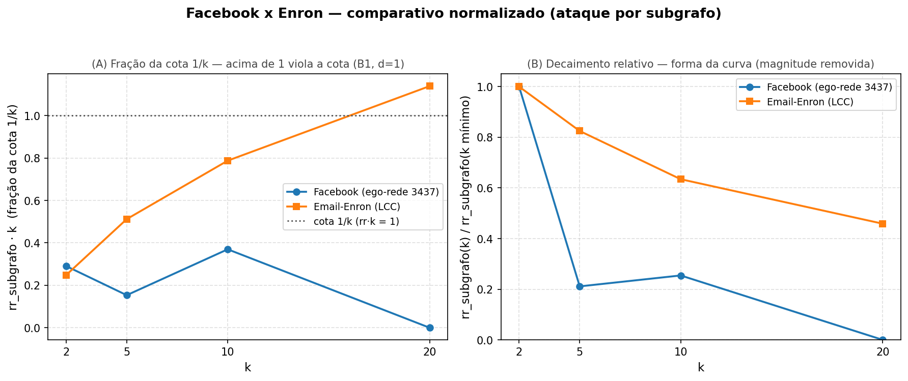

# Resultados do experimento secundário — Email-Enron (He et al. 2009)

> Gerado automaticamente por `experiments/make_enron_table.py`.
> Fonte: `experiments/logs/he2009_enron_secondary/he2009_enron_secondary.jsonl`.
> Issue #128 (S9-6) — comparativo Facebook × Enron + tabelas de risco × utilidade.
> Parte da issue-mãe #29 (dataset secundário do tier **Desejável** `[D]`).

**Dataset:** Email-Enron (SNAP), projeção não-direcionada por **OR** (D-11); maior componente conexa (LCC) com **n=33.696 nós, m=180.811 arestas** (grau médio ≈ 10,7).
**Sementes:** 42, 1337, 2718
**Algoritmo:** He et al. (2009), d=1, sigma=0.5, s_max=4, isomorphism_mode=add_or_delete
**Motor de particionamento:** pymetis (12/12 execuções) — fiel ao artigo.
**Ataques:** grau (tolerance=0) + subgrafo (hop=1) — subgrafo **full** viável via bucketing de WL-hash (D-16); `subgraph_timeout_count=0` em todas as runs.

---

## Enquadramento metodológico — síntese

> **Frase-síntese.** O Email-Enron é o dataset **secundário** (tier Desejável `[D]`) que estende o baseline **Facebook** (tier Mínimo `[M]`) para uma rede de escala e origem distintas: ~63× mais nós (33,7 k vs. 532), derivada de e-mail corporativo **direcionado** e projetada para não-direcionada por simetrização OR (D-11), contra a amizade já-simétrica de uma única ego-rede do Facebook. Ele **não introduz mecanismo novo** — reusa o mesmo pipeline `anonimização → ataque → métrica` — e serve para **aferir se o comportamento privacidade-vs-utilidade do He et al. (2009) se mantém fora da topologia de ego-rede**. A leitura conjunta deve focar **tendências** (sinal e monotonicidade), não magnitudes absolutas, que não são diretamente comparáveis (ver abaixo).

Como no baseline, `d=1` afere **k-anonimato de grau**, não a propriedade *structure-aware* plena (achado B1): em `d=1` a estrutura local de cada nó reduz-se ao seu grau. O ataque por **subgrafo** (isomorfismo de vizinhança 1-hop) é, portanto, o termômetro de quanto a estrutura — não anonimizada em `d=1` — ainda permite associação. Toda a terminologia segue o enquadramento de aferição (D-11): avalia-se **risco de reidentificação / vulnerabilidade agregada**, nunca identificação individual.

---

## Comparativo Facebook × Enron (médias por k, 3 sementes)

> Facebook: `experiments/logs/he2009_facebook_baseline_pymetis/` (carregado). Enron: log desta execução. As duas colunas de cada métrica compartilham `d=1`, `sigma=0.5`, **o mesmo motor de particionamento (pymetis)** e as mesmas 3 sementes; diferem **apenas no dataset**. O baseline Facebook migrou de Kernighan-Lin para pymetis em E1/#211 (D-19), unificando o motor com o Enron e eliminando o confundidor de motor não-pareado que esta comparação registrava (ver C2, abaixo). **Nota:** sob pymetis o Facebook só atinge cobertura plena em k∈{2,5} (`SUCCESS_PARTIAL`) e cai para `FAILURE_LOW_COVERAGE` (cob. ≈0,865) em k∈{10,20}; o marco de k-anonimato de 29/05 permanece válido sobre o run Kernighan-Lin original (ver `docs/results_baseline.md`).

| k | rr_grau FB | rr_grau Enron | rr_subgrafo FB | rr_subgrafo Enron | KS-D FB | KS-D Enron | clust_var FB | clust_var Enron |
|---|-----------|--------------|----------------|-------------------|---------|------------|--------------|-----------------|
| 2 | 0.0232 | 0.0033 | 0.1454 | 0.1241 | 0.0520 | 0.0382 | 0.0529 | 0.0170 |
| 5 | 0.0094 | 0.0023 | 0.0307 | 0.1024 | 0.2744 | 0.0273 | 0.2735 | 0.0514 |
| 10 | 0.2851 | 0.0027 | 0.0370 | 0.0787 | 0.8227 | 0.0387 | 0.1301 | 0.0609 |
| 20 | 0.0883 | 0.0019 | 0.0000 | 0.0569 | 0.9361 | 0.1303 | 0.4703 | 0.0929 |

### Por que as magnitudes ainda devem ser lidas como **tendências**

Sob o **motor unificado (pymetis)**, o degrau de magnitude que separava as duas redes no eixo de privacidade **desapareceu**: em k=2 o `rr_subgrafo` do Facebook (0,145) é da mesma ordem do Enron (0,124) — uma razão de ~1,2×, contra os ~6× que apareciam sob Kernighan-Lin. Isso **fortalece** a comparação no eixo de risco, mas duas diferenças estruturais permanecem não-pareadas, e a tabela deve continuar sendo lida como contraste de **tendências** (sinal, monotonicidade), não de níveis absolutos:

1. **Escala e origem (n, densidade).** O Facebook é uma única ego-rede pequena e densa (n=532); o Enron tem n=33.696 e vem de e-mail **direcionado** achatado por OR (D-11), o que infla conectividade de modo distinto da amizade simétrica do Facebook — grau médio e distribuição de grau diferem. A escala continua governando a **forma** das curvas (quão rápido o risco decai com k), ainda que não mais o **nível** de partida.
2. **Utilidade não comparável em nível.** O eixo de utilidade permanece em faixas muito distintas — KS-D do Facebook chega a **0,94** (k=20), o do Enron a **0,13**: perturbar uma ego-rede pequena desloca a distribuição global de grau muito mais que perturbar uma rede grande. Aqui a sobreposição direta ainda engana.

**Confundidor eliminado (D-19).** A edição anterior listava o **motor de particionamento** como terceira diferença não-pareada (KL no Facebook × pymetis no Enron). Com a reexecução do baseline Facebook em pymetis (E1/#211) os dois datasets passam a compartilhar o motor; esse confundidor **deixou de existir** (ver C2, abaixo, mantida como registro histórico da ameaça e de sua resolução).

**Conclusão (DoD #128).** Sobrepor as duas redes nos mesmos eixos **ainda engana na utilidade**: a faixa de KS-D do Facebook (0–0,94) comprimiria a do Enron (0–0,13) a uma quase-reta. No eixo de risco a sobreposição agora seria legível (faixas 0–0,15 vs. 0–0,12), mas mantém-se a geração **por dataset separadamente** (`results/plots/privacy_utility_enron.*`, mesmo gerador do Facebook) por coerência e por causa do eixo de utilidade; a comparação é feita pela tabela acima, pelas tendências abaixo e pelo painel normalizado.

### O que **é** comparável — tendências e onde elas divergem

- **Subgrafo ≫ grau — robusto no Enron, condicional no Facebook.** No Enron o ataque por subgrafo reidentifica muito mais que o de grau em **toda** a faixa de k (~40× em k=2), confirmando, fora da ego-rede, que **igualar grau não protege a estrutura de vizinhança** — o cerne empírico do módulo. No Facebook sob pymetis a dominância vale em k∈{2,5} (0,145 vs 0,023; 0,031 vs 0,009) mas **inverte** em k∈{10,20}, onde o `rr_grau` sobe (0,285 em k=10) acima do `rr_subgrafo` (0,037): nas células `FAILURE_LOW_COVERAGE` os grupos incompletos deixam nós distinguíveis **por grau**, um artefato de cobertura, não de proteção estrutural.
- **Monotonicidade em k — só no Enron.** O `rr_subgrafo` cai de forma monótona com k no Enron (0,124 → 0,102 → 0,079 → 0,057); no Facebook sob pymetis a queda **não** é monótona (0,145 → 0,031 → 0,037 → 0,000 — leve repique em k=10, ainda dentro das células de baixa cobertura). A tendência de fundo (k-anonimato **reduz** a vulnerabilidade estrutural mesmo em `d=1`) vale nas duas; a regularidade da queda é do Enron.
- **Grau residual no Enron, não no Facebook.** O `rr_grau` é baixíssimo no Enron (≤0,003) — assinaturas de grau isoladas quase nunca são únicas numa rede grande. No Facebook pymetis ele deixa de ser residual nas células de baixa cobertura (0,285 em k=10), pelo mesmo motivo de cobertura acima.
- **Utilidade melhor preservada em escala.** O KS-D do Enron permanece baixo (0,04–0,13) onde o Facebook chega a **0,94** (k=20): perturbar uma rede grande desloca a distribuição global de grau proporcionalmente menos. A anonimização é **menos custosa em utilidade** numa rede grande — a tendência mais robusta da comparação, e agora ainda mais nítida sob o motor unificado.

### Painel comparativo normalizado (gráfico complementar)

Como sobrepor as magnitudes brutas é enganoso (acima), o painel abaixo torna as duas redes legíveis nos **mesmos eixos** por **normalização** — é um complemento ao comparativo, não um substituto dos gráficos por dataset. Gerado por `python -m src.visualization.comparison` (dados em `docs/assets/comparison_fb_enron.csv`).



- **Painel (A) — fração da cota `1/k`** (`rr_subgrafo · k`, linha pontilhada em `1,0`). Acima de `1,0` a cota teórica `rr ≤ 1/k` é **violada** — possível no regime `d=1`, em que o ataque inspeciona a vizinhança 1-hop **não** anonimizada (B1). **Sob o motor unificado o quadro inverte-se face à edição KL:** o Facebook agora fica **abaixo** da cota em todo k (0,29 → 0,15 → 0,37 → 0,00 — pico ~0,37 em k=10, nunca cruzando `1,0`), enquanto o Enron sobe gradualmente e **cruza** a cota só em k=20 (~1,14). As curvas se cruzam cedo, entre k=2 e k=5: em k=2 o Facebook é marginalmente mais alto (0,29 vs 0,25), mas a partir de k=5 o Enron passa a ser o proporcionalmente mais vulnerável — e é o **único** a violar a cota, em k=20. O Facebook deixou de violar a cota `1/k` neste run.
- **Painel (B) — decaimento relativo** (`rr_subgrafo(k)/rr_subgrafo(k mínimo)`), que remove o degrau de magnitude — agora pequeno (~1,2× em k=2) — e isola a **forma** da curva. O Facebook cai abruptamente e de forma **não-monótona** (1,0 → 0,21 → 0,25 → 0,0, com leve repique em k=10), o Enron suavemente e monotonicamente (1,0 → 0,82 → 0,63 → 0,46): k-anonimato extingue a estrutura distinguível de uma ego-rede pequena, mas só a atenua numa rede grande — a **tendência** (risco estrutural cai com k) é comum às duas; a **taxa** e a **regularidade** do decaimento são o que diferem.

### Ameaça à validade — motor de particionamento não-pareado (C2) — **RESOLVIDA**

> **Estado: resolvida em E1/#211 (D-19).** A edição original deste comparativo cruzava **motores diferentes** — baseline Facebook em Kernighan-Lin (achado A1), Enron em pymetis (12/12) — e registrava o motor não-pareado como ameaça à validade interna de baixa magnitude, com o pareamento estrito (Facebook em pymetis) listado como trabalho futuro. Esse trabalho futuro **foi executado**: o baseline Facebook foi reexecutado em pymetis, unificando o motor entre os dois datasets, e esta tabela passou a consumir esse run (D-19). A comparação é agora **pareada por motor** e o confundidor C2 **deixa de se aplicar**. Efeito colateral registrado com fidelidade: sob pymetis o Facebook não atinge cobertura plena em k∈{10,20} (`FAILURE_LOW_COVERAGE`), o que muda algumas leituras de magnitude acima — o marco de k-anonimato de 29/05 permanece ancorado no run Kernighan-Lin original. Ver `docs/results_baseline.md` (seção histórica KL + tabelas pymetis), `docs/decision_log.md` (D-19) e `docs/limitations.md`.

---

## Tabela bruta por (k, semente)

> Valores em **6 casas decimais**. A tabela agregada abaixo é a média dos valores de **precisão plena** do log (não destes valores já arredondados) seguida de arredondamento para 4 casas; por isso `média(arredondados) ≠ arredondamento(média)` pode diferir na última casa (ex.: k=10 → 0,0787; k=20 → 0,0569).

| k | seed | Veredito | coverage_fraction | rr_grau | rr_subgrafo | EG_mean | EG_median | KS_D | KS_p | clust_var |
|---|------|----------|-------------------|---------|-------------|--------|-----------|------|------|-----------|
| 2 | 42 | SUCCESS_PARTIAL | 0.999881 | 0.003235 | 0.122893 | 2.00 | 0 | 0.038610 | 0.0000 | 0.015644 |
| 2 | 1337 | SUCCESS_PARTIAL | 0.999881 | 0.003413 | 0.124110 | 2.00 | 0 | 0.039471 | 0.0000 | 0.019141 |
| 2 | 2718 | SUCCESS_PARTIAL | 0.999881 | 0.003354 | 0.125326 | 2.00 | 0 | 0.036651 | 0.0000 | 0.016224 |
| 5 | 42 | SUCCESS_PARTIAL | 0.999377 | 0.001929 | 0.101971 | 5.00 | 0 | 0.026027 | 0.0000 | 0.050745 |
| 5 | 1337 | SUCCESS_PARTIAL | 0.999377 | 0.002493 | 0.104078 | 5.00 | 0 | 0.027451 | 0.0000 | 0.049000 |
| 5 | 2718 | SUCCESS_PARTIAL | 0.999377 | 0.002434 | 0.101110 | 5.00 | 0 | 0.028342 | 0.0000 | 0.054476 |
| 10 | 42 | SUCCESS_PARTIAL | 0.998338 | 0.003027 | 0.079594 | 9.99 | 0 | 0.033654 | 0.0000 | 0.055225 |
| 10 | 1337 | SUCCESS_PARTIAL | 0.998338 | 0.002255 | 0.078259 | 9.99 | 0 | 0.041934 | 0.0000 | 0.063838 |
| 10 | 2718 | SUCCESS_PARTIAL | 0.998338 | 0.002760 | 0.078377 | 9.99 | 0 | 0.040391 | 0.0000 | 0.063505 |
| 20 | 42 | SUCCESS_PARTIAL | 0.995964 | 0.002077 | 0.056357 | 19.96 | 0 | 0.129184 | 0.0000 | 0.093835 |
| 20 | 1337 | SUCCESS_PARTIAL | 0.995964 | 0.001870 | 0.056980 | 19.96 | 0 | 0.130906 | 0.0000 | 0.089811 |
| 20 | 2718 | SUCCESS_PARTIAL | 0.995964 | 0.001840 | 0.057485 | 19.96 | 0 | 0.130668 | 0.0000 | 0.095031 |

---

## Agregação por k (média ± desvio-padrão, 3 sementes)

| k | Vereditos | coverage_fraction | rr_grau (mean±std) | rr_subgrafo (mean±std) | EG_mean (mean±std) | KS_D (mean±std) | clust_var (mean±std) |
|---|-----------|-------------------|--------------------|------------------------|--------------------|-----------------|----------------------|
| 2 | SUCCESS_PARTIAL | 0.999881±0.000000 | 0.0033±0.0001 | 0.1241±0.0012 | 2.00±0.00 | 0.0382±0.0014 | 0.0170±0.0019 |
| 5 | SUCCESS_PARTIAL | 0.999377±0.000000 | 0.0023±0.0003 | 0.1024±0.0015 | 5.00±0.00 | 0.0273±0.0012 | 0.0514±0.0028 |
| 10 | SUCCESS_PARTIAL | 0.998338±0.000000 | 0.0027±0.0004 | 0.0787±0.0007 | 9.99±0.00 | 0.0387±0.0044 | 0.0609±0.0049 |
| 20 | SUCCESS_PARTIAL | 0.995964±0.000000 | 0.0019±0.0001 | 0.0569±0.0006 | 19.96±0.00 | 0.1303±0.0009 | 0.0929±0.0027 |

---

## Interpretação

- **Ataque por grau** — `rr_grau ∈ [0,0018; 0,0034]`, **bem abaixo** do Facebook em toda a faixa (de ~4× em k=5 a ~100× em k=10, onde o `rr_grau` do FB sobe sob baixa cobertura). Numa rede de 33,7 k nós, assinaturas de grau isoladas raramente são únicas; o ataque mais fraco é quase inócuo já em k=2.

- **Ataque por subgrafo** (isomorfismo 1-hop, caminho rápido por WL-hash, D-16) — `rr_subgrafo` cai monotonicamente de **0,124** (k=2) para **0,057** (k=20), ~40× a taxa de grau. Em `d=1` anonimiza-se o grau, **não** a estrutura 1-hop (B1); o resíduo de ~6 % em k=20 é a vulnerabilidade estrutural que `d=1` não cobre. No baseline Facebook sob pymetis o subgrafo domina o grau em k∈{2,5}, mas a dominância **inverte** em k∈{10,20} (células `FAILURE_LOW_COVERAGE`); no Enron, com cobertura ≥0,996, a dominância do subgrafo é **limpa em toda a faixa**.

- **Cota `rr_subgrafo ≤ 1/k` — não vale em `d=1`.** A cota teórica esperada (`data_dictionary.md`) pressupõe k-anonimato **da estrutura que o ataque inspeciona**, i.e. `d ≥ 2`. Em `d=1` só o grau é anonimizado (B1), então a cota **pode ser violada**: ela vale em k∈{2,5,10} (0,124≤0,5; 0,102≤0,2; 0,079≤0,1) mas **é violada em k=20** (0,057 > 0,050 = 1/20). Isso é **esperado, não um bug** — é a assinatura empírica de que `d=1` afere k-anonimato de grau, não estrutural. Sob `d ≥ 2` (d-sweep) a cota volta a valer. Ver o painel (A) acima.

- **coverage_fraction ≥ 0,9960** em todas as 12 runs, com `deficit_fully_structural=True` (vereditos `SUCCESS_PARTIAL`): a incompletude residual é exclusivamente de **grupos incompletos** (D-06), aceitável pelo critério DL-01 — nenhuma violação de isomorfismo/disjunção.

- **Utilidade.** KS-D cresce com k (0,038 → 0,130) e a variação de clustering idem (0,017 → 0,093), mas ambas permanecem **muito abaixo** das do Facebook: anonimizar uma rede grande custa proporcionalmente menos utilidade global.

- **Divergência em k alto.** No Facebook o `rr_subgrafo` colapsa a 0 em k=20 (a ego-rede inteira cabe em poucos grupos); no Enron permanece em ~0,057 — a rede grande retém estrutura local distinguível mesmo sob k=20. Com o motor agora **pareado** (pymetis nos dois), essa divergência já não pode ser atribuída ao particionamento: ela reflete **escala**, não diferença de mecanismo — a leitura que a edição KL só podia oferecer com a ressalva do confundidor C2.

---

## Reprodutibilidade

```bash
# 1. Execução (12 runs: k∈{2,5,10,20} × 3 sementes)
python -m experiments.run --config experiments/configs/he2009_enron_secondary.yml

# 2. Esta tabela (docs/results_enron.md)
python -m experiments.make_enron_table

# 3. Tabelas CSV (results/tables/enron_{degree,subgraph}.csv)
python -m src.visualization.tables \
    --logs experiments/logs/he2009_enron_secondary \
    --out results/tables --dataset enron

# 4. Gráfico privacidade-utilidade do Enron (results/plots/privacy_utility_enron.*)
python -m src.visualization.privacy_utility \
    --logs experiments/logs/he2009_enron_secondary \
    --out results/plots --stem privacy_utility_enron \
    --title "Privacy vs. Utility — Email-Enron (He et al. 2009)"

# 5. Painel comparativo normalizado Facebook × Enron (snapshot em docs/assets/)
#    Facebook em pymetis (motor unificado com o Enron, D-19/E1).
python -m src.visualization.comparison \
    --fb-logs experiments/logs/he2009_facebook_baseline_pymetis \
    --enron-logs experiments/logs/he2009_enron_secondary \
    --out docs/assets --stem comparison_fb_enron --pdf
```

> Logs, tabelas CSV e plots em `results/` são **gitignored** (`.claude/rules/experiments.md`); versiona-se o YAML de config e os scripts que os regeneram. **Exceção documentada:** o snapshot comparativo em `docs/assets/` (`comparison_fb_enron.png` + `.pdf` + `.csv`) é versionado por ser artefato auditável publicamente, e permanece regenerável pelo comando 5. As referências cruzadas: D-11 (projeção OR), D-15/D-16 (viabilidade do subgrafo), achados A1/B1; ver `docs/decision_log.md` e `docs/results_baseline.md`.
